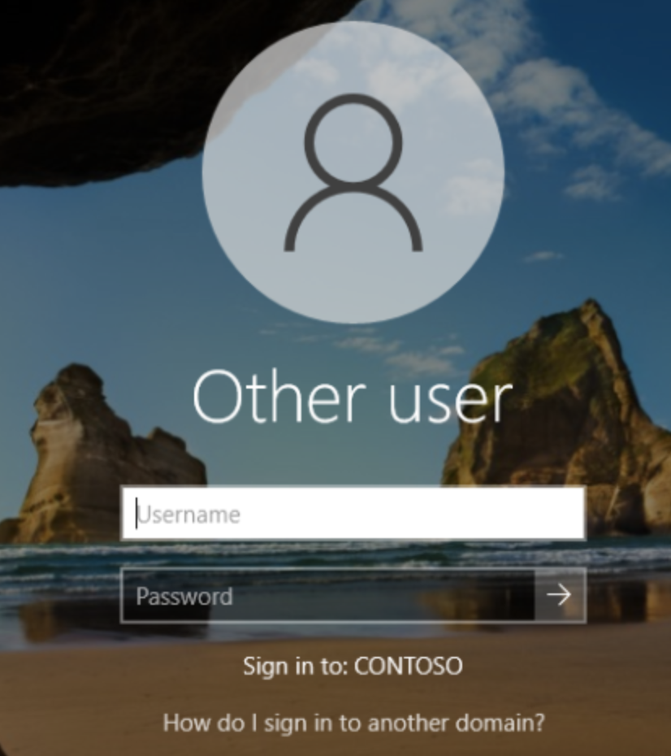

# Logon Types

Есть разные способы авторизоваться в Windows, и каждый из этих способов оставляет где-то кредсы. Для пентестера важно знать, где можно найти те или иные учетные данные.

## Interactive logon

Логин локально  на физической тачке или через runas. Кредсы кэшируются в lsass.



```
runas /user:<username> cmd
```

NT хеш (если пользователь локальный) попадет в SAM. Если доменная учетка, то компьютер проверит кредсы путем запроса TGT, TGT будет сохранен в кэш. Если DC недоступен, то компьютер посмотрит в хранилище DCC (Domain cached credentials) в поисках последнего доменного пользователя, авторизовавшегося на компьютере. Если TGT не попал в кэш, значит авторизация не прошла.

В итоге: NT хеш от пароля в lsass процесс, если это была доменная учетка, то kerberos keys, сгенерированные на пароле и тикеты так же кэшируются.

Для Interactive Logon нужны права [SeInteractiveLogonRight](https://docs.microsoft.com/en-us/windows/security/threat-protection/security-policy-settings/allow-log-on-locally)

Примеры:

```
runas /user:fortress\secureservice cmd.exe
```

## NewCredentials Logon

The NewCredentials logon happens when using [runas](https://docs.microsoft.com/en-us/previous-versions/windows/it-pro/windows-server-2012-R2-and-2012/cc771525\(v=ws.11\)) with the `/netonly`. Then, the launched process will be use the credentials only for remote connections, keeping the current user session for local operations.

```
runas /netonly /user:CONTOSO\OtherUser cmd
```

The credentials are not checked until a network connection is done, but they are cached when the `runas` command is executed, just like in the [Interactive Logon](https://zer1t0.gitlab.io/posts/attacking\_ad/#interactive-logon) (except for Kerberos tickets, since they are retrieved when the credentials are checked). You must take this into account since this method **allows to cache fake credentials** in the lsass process, and is sometimes [used by the blue team to create honey credentials](https://securitywa.blogspot.com/2016/04/improve-detection-using-honeycreds.html) in order to detect attackers.

## Network Logon

Этот тип входа осуществляется при подключении через не интерактивные сервисы — SMB, SQL, RPC, ... Для этого типа аутентификации нам нужен пароль, или Kerberos тикет, или NT хеш. Соответственно, они подвержены Pass-The-Hash, Pass-The-Key и Pass-The-Ticket атакам. На удаленной машине не кэшируются кредсы (исключение — делегирование).

Attack to share

```
dir \\ws01-10\Temp
```

Execute PsExec

```
.\PsExec.exe \\dc01 cmd

# As SYSTEM with Interactive shell
.\PsExec64.exe -i -s \\target -u user -p password powershell.exe
```

Этот тип аутентификации используют преимущественно администраторы.

## Batch Logon

Запуск задач по расписанию из-под пользователя. Кредсы сохранятся в lsass процессе при запуске задачи

Task creation with user credentials:

```
schtasks.exe /create /tn notepaddaily /tr notepad.exe /sc daily /ru CONTOSO\TaskUser /rp task1234!
```

Можно иметь права на запуск задач, и не иметь на создание.

## Service Logon

Используется, когда сервис хочет запуститься в контексте пользователя. Пароль в открытом виде кладется в LSA, кредсы кладутся в lsass процесс при запуске службы.

Service creation with user credentials:

```
sc.exe create MySvc2 binpath= c:\windows\system32\notepad.exe obj=CONTOSO.local\svcUser password=svc1234!
```

Можно иметь права на запуск сервиса, и не иметь на создание.

## NetworkCleartext Logon

In case of NetworkCleartext logon the password is sent over the network to the target machine (in an encrypted communication). This logon type is used by Powershell remoting when CredSSP authentication is specified.

It should be noticed that credentials are cached in the target machine since they are sent in the communication.

```
New-PSSession -Credential $(Get-Credential) -Authentication Credssp
```

## Remote Interactive Logon

The RemoteInteractive logon is used when you connect to a machine over [RDP](https://zer1t0.gitlab.io/posts/attacking\_ad/#RDP). RDP uses [CredSSP](https://zer1t0.gitlab.io/posts/attacking\_ad/#cred-ssp) for remote login so the password are sent over the network to the target machine and therefore credentials are cached in the remote lsass process.

To being able to log on a remote computer by using the RemoteInteractive logon your user need to be part of the [Remote Desktop Users](https://docs.microsoft.com/en-us/windows/security/identity-protection/access-control/active-directory-security-groups#bkmk-remotedesktopusers) or having the [SeRemoteInteractiveLogonRight](https://docs.microsoft.com/en-us/windows/security/threat-protection/security-policy-settings/allow-log-on-through-remote-desktop-services) right in the target machine.

Как разрешить себе доступ на удаленном сервера (при наличии привилегий):

```powershell
# Добавил myuser в Remote Desktop Users
net localgroup "Remote Desktop Users" domain\myuser /add

# Разрешил подключение по RDP на сервере
Set-ItemProperty -Path 'HKLM:\System\CurrentControlSet\Control\Terminal Server' -name "fDenyTSConnections" -value 0

# Добавил разрешающее правило в фаерволл
Enable-NetFirewallRule -DisplayGroup "Remote Desktop"
```
